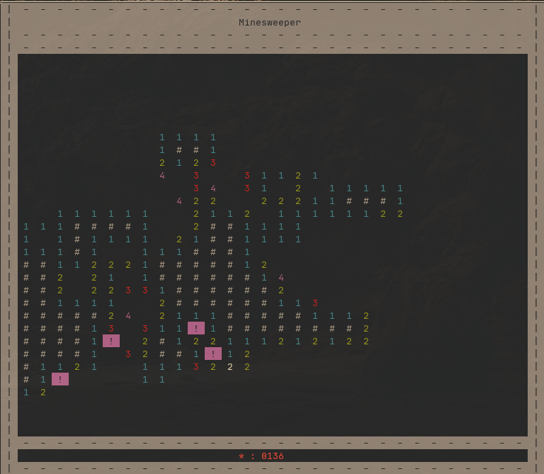

<p align="center"></p>

<p align="center"></p>

<br>

Saper coded in C++ and made to work in a terminal out of my passion for the game. Works on LINUX and WINDOWS.


> Libraries used :
>
> ostream, vector, stack, cstdlib, map, utility, termios.h, unistd.h, conio.h, ctime


<br>

##  Installation Steps:

1. Clone the repo &amp; open it


```bash
 git clone https://github.com/Jejis06/saper.git && cd saper
```

2. Compile the game

```bash
g++ src/main.cpp -o saper
```

3. Run it

```bash
./saper
```

<br>

## Controls

 I have implemented controls that felt right to me : 
 ```python
    

    (a, s, w ,d) & (h, j, k, l) --> (left, down, up, right)
         ^                 ^
         |                  \____
         |                       |
      For classic players      For those wronged by Vim

   
    (f) - place a flag  
    (r) - reveal a cell
 ```

<br>

## GUI
> The colors used by the program are imported from your terminal's default colors

```c++
 |  -  -  -  -  -  -  -  -  -  -  -  -  -  -  -  -  -  -  -  -  | 
 |                            Saper                             |  <----  Title screen
 |  -  -  -  -  -  -  -  -  -  -  -  -  -  -  -  -  -  -  -  -  | 
 |  -  -  -  -  -  -  -  -  -  -  -  -  -  -  -  -  -  -  -  -  | 
 |  _  _  _  _  _  _  _  _  _  _  _  _  _  _  _  _  _  _  _  _  | 
 |  _  _  _  _  _  _  _  _  _  _  _  _  _  _  _  _  _  _  _  _  | 
 |  _  _  _  _  _  _  _  _  _  _  _  _  _  _  _  _  _  _  _  _  | 
 |  _  _  _  _  _  _  _  _  _  _  _  3  3  2  _  _  _  _  _  _  | 
 |  4  _  _  _  _  _  _  _  _  _  6  _  3  _  _  _  _  _  _  _  | 
 |  _  3  2  3  !  !  _  _  _  _  !  3  !  3  2  _  _  _  _  _  | 
 |  _  3  1  1  2  3  3  _  3  4  4  5  3  3  !  _  _  _  _  _  | 
 |  _  !  4  3  3  2  3  2  2  1  !  !  !  4  4  _  _  _  _  _  |  <---- Game Screen
 |  _  _  _  !  !  !  2  !  1  1  2  4  4  !  !  _  _  _  _  _  | 
 |  _  _  _  _  _  3  3  1  1  #  #  2  !  5  5  _  _  _  _  _  | 
 |  _  _  _  _  _  _  2  #  #  #  1  3  !  5  !  _  _  _  _  _  | 
 |  _  _  _  _  _  _  3  #  1  2  4  !  6  !  !  _  _  _  _  _  | 
 |  _  _  _  _  _  _  3  1  2  !  !  !  !  !  _  _  _  _  _  _  | 
 |  _  _  _  _  _  _  _  _  _  _  _  _  _  _  _  _  _  _  _  _  | 
 |  _  _  _  _  _  _  _  _  _  _  _  _  _  _  _  _  _  _  _  _  | 
 |  _  _  _  _  _  _  _  _  _  _  _  _  _  _  _  _  _  _  _  _  | 
 |  _  _  _  _  _  _  _  _  _  _  _  _  _  _  _  _  _  _  _  _  | 
 |  _  _  _  _  _  _  _  _  _  _  _  _  _  _  _  _  _  _  _  _  | 
 |  _  _  _  _  _  _  _  _  _  _  _  _  _  _  _  _  _  _  _  _  | 
 |  _  _  _  _  _  _  _  _  _  _  _  _  _  _  _  _  _  _  _  _  | 
 |  -  -  -  -  -  -  -  -  -  -  -  -  -  -  -  -  -  -  -  -  | 
 |                         * : 0134                             |  <---- Mines left
 |  -  -  -  -  -  -  -  -  -  -  -  -  -  -  -  -  -  -  -  -  | 
```

> I made this section only to show what the mine counter shows other labels are just so it doesn't look so bland


<br>

## Project Screenshots:

<p align="center"></p>

> Screenshot was made in my terminal (I love gruvbox)